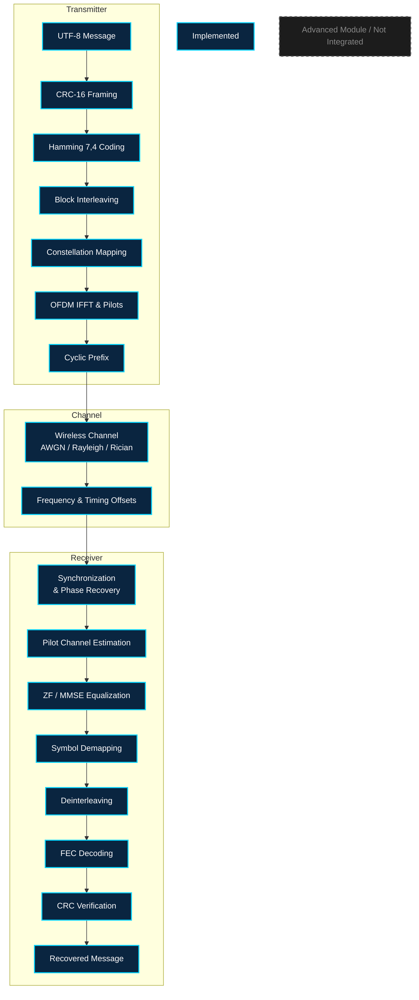
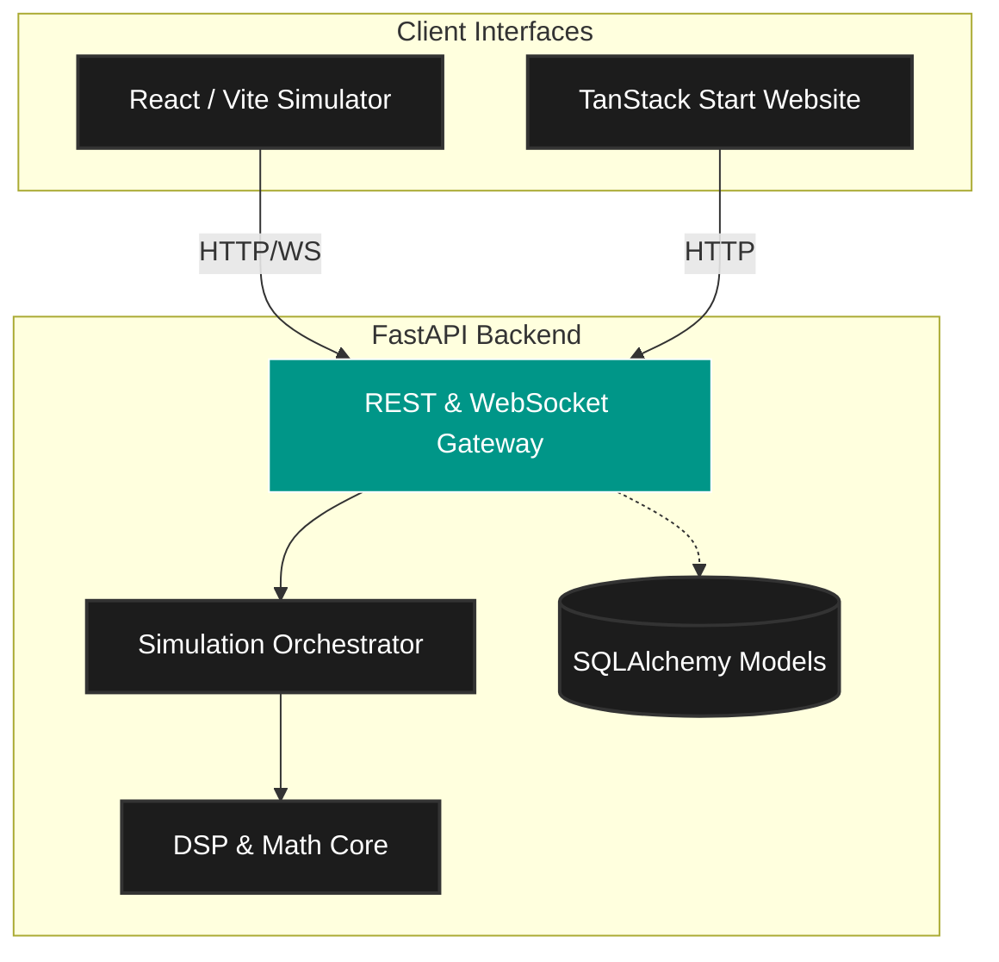

<div align="center">
  

  # WaveCore X
  **Baseband Wireless Communications Simulator & Signal Engineering Platform**

  [](https://wavecore-x-website.vercel.app/)
  [](https://wave-core-x-5-g-6-g-signal-engineer.vercel.app/)
  [](https://fastapi.tiangolo.com/)
  [](#validation-and-results)

  *Trace a message through coding, constellation mapping, OFDM, modeled fading channels, receiver equalization, and recovery across an explicitly implemented end-to-end software simulation pipeline.*
</div>

<br />

## 📡 Engineering Overview

WaveCore X is a deterministic, complex-baseband wireless communication simulator engineered for exploring the complete signal processing chain. Unlike abstract theoretical models that skip implementation details, WaveCore X explicitly wires the core link from message framing to receiver recovery. 

The primary engineering problem this platform addresses is the **opacity of intermediate transformations** in modern telecommunications. By inspecting the complete communication chain, researchers and engineers can observe the exact impact of channel impairments, error correction, and equalization algorithms on the resulting constellation and bit error rates.

Users can dynamically configure source messages, modulation schemes (BPSK through 256-QAM), channel conditions (AWGN, Rayleigh, Rician), and receiver equalizers (Zero-Forcing, MMSE), then explicitly observe the resulting signal integrity metrics.

## 🔗 Complete Signal-Chain Visualization

The core simulation pipeline executes the following deterministic transformations. 
*(Note: Advanced features like Polar coding and OFDMA are implemented as independent modules and are planned for future pipeline integration).*



## 🚀 Live Simulator

The complete frontend interface and backend engine are deployed live.

👉 **[Launch WaveCore X Simulator](https://wave-core-x-5-g-6-g-signal-engineer.vercel.app/)**
👉 **[View Product Documentation Website](https://wavecore-x-website.vercel.app/)**

**Workflow:**
1. Enter a text payload.
2. Select a modulation scheme (e.g., 16-QAM) and SNR.
3. Choose a channel model (AWGN or Fading).
4. Run the simulation.
5. Inspect the resulting constellation diagrams, OFDM grid, and Bit Error Rate (BER) metrics.

## ⚙️ Technical Capabilities

### Implemented Core Pipeline
- **Source Integrity:** UTF-8 conversion and CRC-16-CCITT framing for end-to-end error detection.
- **Forward Error Correction (FEC):** Hamming(7,4) coding with block interleaving.
- **Modulation:** BPSK, QPSK, 16-QAM, 64-QAM, and 256-QAM mapping to complex baseband symbols.
- **Multicarrier (OFDM):** Pilot insertion, IFFT-based orthogonal frequency-division multiplexing, and cyclic prefix addition.
- **Wireless Channels:** Configurable AWGN, flat block Rayleigh, and Rician fading models.
- **Receiver:** Pilot-aided Least Squares (LS) channel estimation, Zero-Forcing (ZF), and Minimum Mean Square Error (MMSE) equalization.
- **Analytics:** Post-simulation deterministic evaluation of BER, SER, EVM, and raw throughput.

### Experimental / Standalone Modules (Phase 1 Additions)
*These modules exist in the DSP repository but are pending integration into the primary simulation pipeline.*
- **Advanced Coding:** Convolutional encoding (Viterbi decoding), Reed-Solomon GF(256), LDPC (min-sum), and Polar coding baselines.
- **Advanced OFDM:** Resource grid modeling, OFDMA multi-user subcarrier allocation, guard-band reservation.
- **Advanced Channel:** Tapped-delay-line multipath, Jakes Doppler spectrum, log-normal shadow fading.

## 🏗️ System Architecture

WaveCore X strictly separates the web interface, the REST/WebSocket API layer, the simulation orchestrator, and the DSP numerical core.



## 📐 Mathematical Foundations

The core metrics generated by the simulation engine are rooted in standard telecommunications theory:

* **Bit Error Rate (BER):** 
  The ratio of incorrectly recovered bits to the total number of transmitted bits.
  $$BER = \frac{N_{errors}}{N_{total}}$$
* **Error Vector Magnitude (EVM):**
  A measure of the deviation of received symbols from their ideal constellation points, capturing the aggregate effect of channel noise and fading.
* **Minimum Mean Square Error (MMSE) Equalization:**
  Balances channel inversion with noise amplification.
  $$W_{MMSE} = \frac{H^*}{|H|^2 + \frac{1}{SNR}}$$
  *(Where $H$ is the estimated channel coefficient and $SNR$ is the linear signal-to-noise ratio).*

## 📂 Repository Structure

```text
.
├── frontend/               # React / Vite Simulator UI
│   ├── src/app/api/        # Typed frontend API clients
│   └── ...
├── wavecore/               # Core Backend Application
│   ├── api/                # FastAPI routes, REST & WebSocket schemas
│   ├── dsp/                # Numerical algorithms & signal processing
│   │   ├── coding.py
│   │   ├── modulation.py
│   │   ├── ofdm.py
│   │   ├── channel.py
│   │   └── equalization.py
│   └── simulation/         # Pipeline orchestrator
├── website/                # Product Documentation Website (TanStack Start)
├── tests/                  # Pytest integration & unit tests
└── WAVECORE_X_DELIVERY_REPORT.md
```

## 💻 Installation and Local Execution

### 1. Backend (FastAPI + DSP Engine)
Requires Python 3.10+.

```powershell
# Create and activate virtual environment (Windows)
python -m venv .venv
.venv\Scripts\activate

# Install dependencies in editable mode
pip install -e ".[dev]"

# Run the API server
uvicorn wavecore.api.main:app --reload --host 127.0.0.1 --port 8001
```
*API Documentation (Swagger UI) is available at: `http://127.0.0.1:8001/docs`*

### 2. Simulator Frontend (React + Vite)
Requires Node.js 20+.

```powershell
cd frontend
npm install
npm run dev -- --host 127.0.0.1 --port 5174
```

### 3. Product Documentation Website (Optional)
```powershell
cd website
npm install
npm run dev -- --host 127.0.0.1 --port 5180
```

## 📡 API Documentation

WaveCore X exposes typed REST and WebSocket endpoints for executing simulations.

### `POST /api/v1/simulations/run`
Executes a complete end-to-end simulation.

**Example Request:**
```bash
curl -X POST http://127.0.0.1:8001/api/v1/simulations/run \
  -H "Content-Type: application/json" \
  -d '{"message":"WaveCore X","modulation":"QPSK","channel":{"model":"AWGN","snr_db":30.0}}'
```

**Verified Output Schema:**
```json
{
  "simulation_id": "sim_3a9f8b2...",
  "input_message": "WaveCore X",
  "recovered_message": "WaveCore X",
  "crc_ok": true,
  "metrics": {
    "ber": 0.0,
    "packet_error": false,
    "coding_scheme": "HAMMING74",
    "equalizer": "ZERO_FORCING"
  },
  "traces": [
    {
      "name": "transmitted_waveform",
      "summary": "...",
      "data": {}
    }
  ]
}
```

## 🧪 Validation and Results

WaveCore X enforces strict test coverage to ensure numerical correctness of the DSP implementations and API stability.

To run the backend test suite:
```powershell
pytest -q -rA
```
**Current Status (v0.1.0):** 41 tests passed, including REST, WebSocket integration tests, and deterministic seeded channel tests. 

*Note: These tests validate the integrity of the software mathematical model; they do not represent hardware RF measurements or 3GPP/NR standards compliance.*

## 🛠️ Technology Stack

            

## 🚧 Limitations & Roadmap

### Implemented
- ✅ End-to-end message framing to recovery path.
- ✅ Seeded deterministic channel runs.
- ✅ Basic pilot-bearing OFDM and equalization (ZF/MMSE).

### Planned / Roadmap
- ⏳ **Integration of Advanced Modules:** Wiring the existing LDPC, Polar coding, and multipath tapped-delay-line models into the primary FastAPI simulation pipeline.
- ⏳ **Database Persistence:** Utilizing the implemented SQLAlchemy models to save and recall experiment histories across sessions.
- ⏳ **Advanced Synchronization:** Implementing timing correction and CFO loop filtering at the receiver side (currently applied as fixed impairments).

## 🤝 Contribution & Reproducibility

WaveCore X is an open-source engineering tool. If you are a DSP researcher or wireless engineer, contributions to the `wavecore/dsp/` algorithms are welcome.
1. Ensure all new DSP mathematical implementations are strictly isolated from FastAPI dependencies.
2. Maintain deterministic behavior by accepting a random seed in stochastic functions.
3. Run `pytest` before submitting pull requests.

## 📜 References
The mathematical implementations within this simulator are derived from standard digital communications theory, targeting baseband representations rather than hardware specific RF passband behavior. 

---
<div align="center">
  <i>Simulate. Analyze. Understand.</i> <br/>
  <b>WaveCore X</b>
</div>
